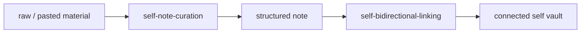
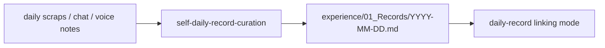
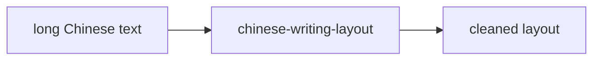
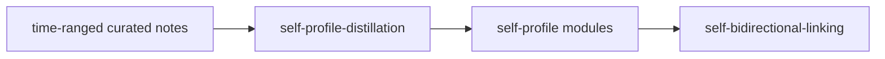

# gugugu_skill

这是我自用的一组 Codex / OpenAI skill 和提示词 / 协议文档，主要围绕中文写作排版、Obsidian/self vault 笔记整理、日记录沉淀、双向链接维护、长期自我模型更新，以及视频讲义整理、产品 / 视觉逆向工程。

这些材料的共同原则是：少发明、多保留；少润色、多显形；尽量把原始材料中已经存在的结构、判断、证据和线索整理出来，而不是把它们改写成泛泛的 AI 文案。

## Skill 列表

| Skill | 主要功能 | 典型使用场景 |
| --- | --- | --- |
| [`chinese-writing-layout`](chinese-writing-layout/) | 中文口述稿、长文本和文本墙的克制排版整理 | 语音输入转写、长段中文分段、只排版不改写、轻量恢复原文已经暗示的列表结构 |
| [`self-note-curation`](self-note-curation/) | 把原始材料整理成可长期保存的结构化笔记 | 从聊天、草稿、转写、原文里沉淀一篇笔记，保存到 `项目/不知道怎么分类就随便放了/` |
| [`self-daily-record-curation`](self-daily-record-curation/) | 把一天的零散材料整理成结构化日记录 | 把日常流水、聊天、语音碎片整理成 `今日状态 / 经历 / 想法 / 灵感与线索 / 推理或思路 / 证据与来源` |
| [`self-bidirectional-linking`](self-bidirectional-linking/) | 为笔记添加有理由的来源链接、语义双链和日记录链接 | 新笔记保存后，把它和 vault 内强相关笔记连接起来；处理从 `raw/` 派生出的来源追踪 |
| [`self-note-formatting`](self-note-formatting/) | 对指定笔记做最小化 Markdown 和中文排版规范化 | 修空行、标题/list 间距、中英数字空格、直角引号和中文标点；不改意思、不重写、不加双链 |
| [`self-profile-distillation`](self-profile-distillation/) | 从一段时间的笔记中提炼稳定自我模型 | 按周、月或项目阶段更新 `self-profile/`，沉淀认知哲学、思维风格、语言风格和行为特征 |

## 提示词 / 协议列表

这些文件不是 Codex skill，不一定包含 `SKILL.md`。它们更适合作为可复制、可改写、可直接粘贴到模型里的工作协议或长提示词使用。

| 文档 | 主要功能 | 典型使用场景 |
| --- | --- | --- |
| [`视频讲义+配图策划提示词.md`](视频讲义+配图策划提示词.md) | 将原文整理成适合 Obsidian / Markdown 展示的视频讲义，并在恰当位置规划图片占位符和配图说明 | 把文章、草稿、转写稿整理成可边讲边滑动展示的屏幕讲义，同时为后续生图准备提示 |
| [`逆向工程/`](逆向工程/) | 产品设计逆向工程、视觉克隆和不同粒度的逆向工程提醒协议 | 在复刻、分析或重建界面前，先拆解产品定位、页面结构、布局系统、色彩字体和组件关系 |

## 核心使用场景

### 1. 中文口述稿只排版

使用 [`chinese-writing-layout`](chinese-writing-layout/)。

适合处理很长、很密、由语音输入或口述转写形成的中文内容。它只做段落、必要标点、中文排版和源文已经暗示的轻量列表结构，不会主动添加标题、总结、观点或新例子。

示例触发：

```text
Use $chinese-writing-layout to clean up this long Chinese voice draft.
```

或：

```text
这段语音稿只排版，不改写。
```

### 2. 原始材料沉淀成长期笔记

使用 [`self-note-curation`](self-note-curation/)。

适合把聊天记录、草稿、转写稿、原文材料整理成一篇更耐用的 Markdown 笔记。它会尽量保留原始语言和推理路径，同时显化问题本质、推理链、证据、约束、处理倾向、概念结构和可沉淀条目。

默认保存位置：

```text
项目/不知道怎么分类就随便放了/YYYY-MM-DD_Topic.md
```

结构化时会使用三个分析镜片，但只填源材料能支撑的内容：

- 本体论拆解：Goal、Agent、Resources、Constraints、Process、Outcome
- 第一性原理拆解：显性假设、隐含假设、最小必要要素、本质与表象、可删冗余
- Polanyi 经验线索：Personal Knowledge、Tacit Knowledge、From-to Structure、Commitment、Discovery

### 3. 每日记录整理

使用 [`self-daily-record-curation`](self-daily-record-curation/)。

适合把一天中的杂乱素材整理成固定结构的日记录。它不会把日常记录上升成方法论或人格总结，但会保留当天可见的经历、想法、灵感、推理路径和证据来源。

默认保存位置：

```text
experience/01_Records/YYYY-MM-DD.md
```

默认结构：

```md
## 今日状态
## 经历
## 想法
## 灵感与线索
## 推理或思路
## 证据与来源
```

保存后会自动触发 [`self-bidirectional-linking`](self-bidirectional-linking/) 的 daily-record mode，只搜索记录日期及前 7 天附近的候选笔记，避免为了日记录扫描整个 vault。

### 4. 笔记双向链接

使用 [`self-bidirectional-linking`](self-bidirectional-linking/)。

它专门处理笔记关系，而不是正文整理。支持三类链接：

- Source Links：从 `raw/` 派生出的结构化笔记必须回链原始材料，原始材料也要列出已处理笔记。
- Semantic Links：两个笔记在主题、项目、问题、决策、证据或延续关系上有强关联时，添加双向 wiki link 和简短理由。
- Day Links：某篇笔记和某天日记录有明确活动上下文时，添加轻量 day context。

它的边界很严格：宁可不加，也不为了关键词重合制造弱链接。

### 5. 单篇笔记格式化

使用 [`self-note-formatting`](self-note-formatting/)。

它和 [`self-bidirectional-linking`](self-bidirectional-linking/) 不重复。

`self-note-formatting` 只负责指定笔记的排版和 Markdown hygiene，例如：

- 段落、标题、列表、引用、代码块、表格周围的空行
- 中文与英文、中文与数字、数字与单位的常见空格
- 中文语境下的标点规范，强制使用直角引号 `「」` / `『』`
- 缺失 frontmatter 时补 `created: YYYY-MM-DD`

它明确不做：

- 内容重写
- 结构化沉淀
- 移动、拆分、合并笔记
- 添加 backlinks 或 related-notes section

所以它应该和 `self-bidirectional-linking` 同时保留：一个管版式，一个管关系。

### 6. 自我模型提炼

使用 [`self-profile-distillation`](self-profile-distillation/)。

适合低频地从一段时间内的 `lite/`、`insight/`、`experience/`、`drafts & doing/` 等材料中，提炼相对稳定、反复出现的模式，并更新 `self-profile/` 下的固定文件。

输出层包括：

- `00_Self Profile.md`
- `01_认知哲学.md`
- `02_思维风格.md`
- `03_语言风格.md`
- `04_行为特征.md`

它要求用户给定时间范围，并且只提炼跨笔记重复出现的长期模式，不把单条情绪或孤立观点升级成稳定特征。

### 7. 视频讲义与配图策划

使用 [`视频讲义+配图策划提示词.md`](视频讲义+配图策划提示词.md)。

它适合把原始内容整理成用于录制教学视频的屏幕讲义。重点不是重写文章，而是保留原文表达和思考顺序，轻度结构化成适合 Obsidian / Markdown 展示、边讲边滚动的讲义，并在适合的位置插入图片占位符和配图说明。

它会特别关注：

- 低干预保留原文
- 轻度标题、段落、列表和引用块整理
- 讲解节奏和画面停顿
- 抽象概念、话题切换、长文字之后的配图位置
- 面向生图 AI 的配图说明

### 8. 产品和视觉逆向工程

使用 [`逆向工程/`](逆向工程/) 下的协议文档。

这个目录不是 skill，而是一组逆向工程提示词和短提醒版协议。适合在分析或复刻一个产品、页面、界面视觉之前使用，先拆产品定位、信息结构、布局、视觉系统、组件和交互状态，再进入实现。

其中包括：

- [`产品设计逆向工程协议.md`](逆向工程/产品设计逆向工程协议.md)：偏产品定位、结构、布局和设计系统的完整拆解。
- [`视觉克隆协议.md`](逆向工程/视觉克隆协议.md)：偏页面结构、空间关系、色彩、字体和组件还原。
- [`逆向工程短提醒版.md`](逆向工程/逆向工程短提醒版.md)：适合作为简短执行提醒。
- [`最简短的逆向工程.md`](逆向工程/最简短的逆向工程.md)：极简版提示。

## 推荐工作流

### 原始材料到长期笔记



### 日常记录



### 只排版，不改写



### 长期自我模型更新



## Skill 安装方式

把需要的 skill 目录复制到 Codex 的个人 skills 目录下即可。只有包含 `SKILL.md` 的目录才按 skill 安装。每个 skill 目录都以 `SKILL.md` 为入口，并可包含：

- `references/`：规则、模板和判断标准
- `agents/openai.yaml`：在 OpenAI / Codex 界面中的展示名、简介和默认 prompt

可以整体复制本仓库中的 skill 目录，也可以只复制其中几个常用目录。

提示词 / 协议文件不需要安装到 skills 目录。需要时直接打开对应 Markdown 文件，把内容作为提示词使用即可。

## 调用方式

在 Codex 中直接用 skill 名称触发，例如：

```text
Use $self-note-curation to organize this source into a durable note.
```

```text
Use $self-daily-record-curation to organize today's scattered material.
```

```text
Use $self-bidirectional-linking to connect this note to strong related notes.
```

中文自然语言也可以触发，例如：

```text
帮我把这段语音稿只排版，不改写。
```

```text
把这个 raw 笔记沉淀成一篇结构化笔记。
```

```text
整理今天的日记录，然后和最近相关笔记连一下。
```

提示词 / 协议文档通常不通过 skill 名称触发，而是直接复制文档内容，或把文件作为上下文交给模型。

## 设计原则

- 忠实来源：只能组织、显化和压缩源材料已经支持的内容。
- 克制改写：不把个人笔记改成通用 AI 文案。
- 强关系优先：链接必须能解释，弱关键词关系不连。
- 文件边界清晰：skill、提示词、协议文档分开维护；排版、沉淀、日记录、双链、自我模型、讲义整理和逆向工程各自负责不同阶段。
- frontmatter 简化：笔记 frontmatter 默认只保留 `created`。
- vault 安全：所有相关 skill 都禁止读取 `.obsidian/` 和 `.trash/`。

## 目录结构

```text
.
├── 逆向工程/
├── chinese-writing-layout/
├── self-bidirectional-linking/
├── self-daily-record-curation/
├── self-note-curation/
├── self-note-formatting/
├── self-profile-distillation/
└── 视频讲义+配图策划提示词.md
```
